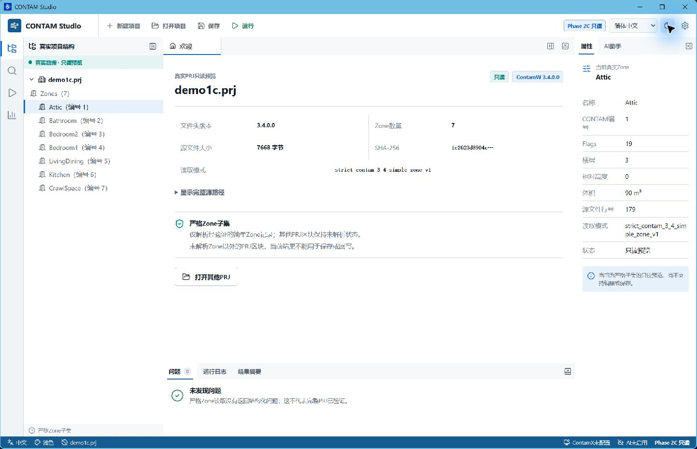
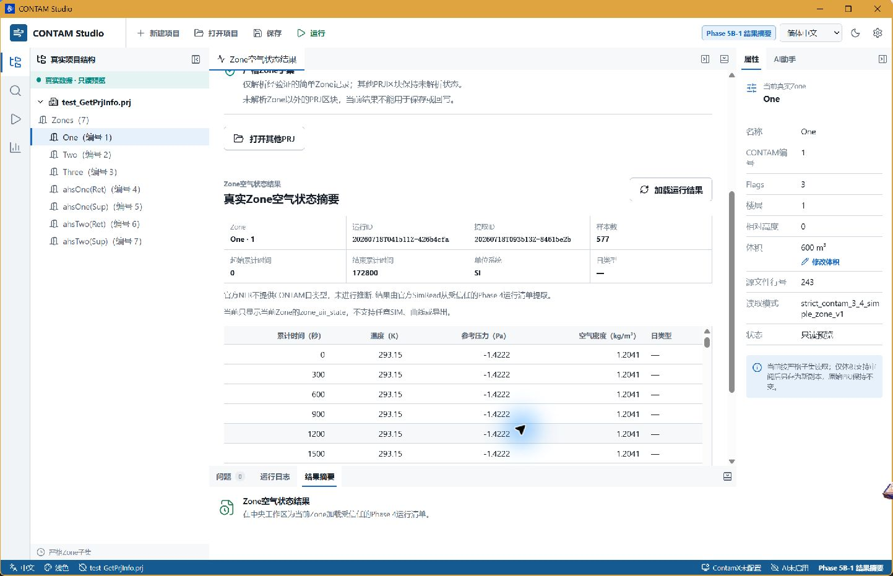

# CONTAM Studio

CONTAM Studio是一个面向教学与科研的现代化、离线优先、中英文双语CONTAM桌面工作台，使人和AI能够通过同一套安全、结构化、可审查的接口使用官方ContamX。

## 目标用户

- 建筑环境、暖通、通风和室内空气品质相关专业的学生。
- 使用CONTAM开展教学的教师。
- 使用CONTAM开展科研的研究人员和研究生。

项目当前不面向大众消费者、复杂企业平台或大型设计院完整工作流。

## 核心价值

- 保留官方ContamX作为数值求解内核，不重写CONTAM求解算法。
- 提供现代、双语且离线优先的教学与科研工作流。
- 让GUI和AI共用语义化领域接口，所有修改均可审查、验证和追溯。
- 将原始PRJ、项目快照和运行结果置于明确的数据安全边界内。

## 当前阶段

项目当前进入**Phase 5B-2：最新成功运行直达当前Zone结果**。桌面运行成功后，Rust只在内存保留受项目session和SHA-256约束的最新manifest；用户明确点击“加载最新运行结果”或“查看当前Zone结果”后，宿主直接复用Phase 5A提取，不再要求重新寻找刚生成的清单。运行结束不会自动调用SimRead，手动选择已有运行清单的入口仍保留。

## 架构方向

当前已批准的首选方向是React+TypeScript前端、Tauri 2桌面宿主、Python CONTAM领域核心和官方ContamX求解器，Windows 10/11 64位为首要平台。Phase 2C已在开发环境验证Tauri与Python之间的一次性进程JSON桥；Python运行时冻结、安装包集成及长期进程策略仍需后续Spike验证。

```text
React GUI
↓
Tauri桌面宿主
↓
受控通信接口
↓
Python CONTAM领域核心
↓
官方ContamX
```

Phase 1实现了React前端与最小Tauri桌面宿主；Phase 2建立了严格Zone纯文档读取器和桌面只读闭环；Phase 3A-0建立哈希绑定、仅写副本的Python Patch。Phase 3B将计划、Diff审阅、原生另存为和副本重读接入同一一次性Python桥。Rust持有活动项目快照与完整Patch，React只取得审阅视图；contamxpy隔离稳态初始化入口没有接入GUI。

## 开发启动

需预先安装Node.js、pnpm、Python 3.12、Rust MSVC工具链和Visual Studio C++桌面开发组件。项目使用自己的`python/.venv`，不依赖PATH中的任意Python。

```powershell
py -3.12 -m venv python\.venv
python\.venv\Scripts\python.exe -m pip install -e ".\python[dev]"
pnpm install
pnpm tauri dev
```

仅构建前端可运行`pnpm build`，前端单元测试运行`pnpm test`。开发环境可通过`CONTAM_STUDIO_PYTHON`显式指定一个绝对Python解释器路径；未配置时只检查仓库内`python\.venv\Scripts\python.exe`，不会回退到系统PATH。



Phase 3B的桌面审阅流程和验证状态见[开发与验证记录](docs/development/phase-3b-zone-volume-gui-verification.md)。



## Python严格Zone文档读取

完成`python/`依赖安装后，可对仓库内的官方测试样例执行纯文档读取：

```powershell
python\.venv\Scripts\python.exe -m contam_studio_core.prj_zone_reader `
  fixtures\contam\official-contamxpy\test_GetPrjInfo.prj --json
```

该入口固定使用`strict_contam_3_4_simple_zone_v1`，只支持文件头`ContamW 3.4.0.0`和`ContamW 3.4.0.4`下经验证的19字段简单Zone记录。它不调用contamxpy、ContamX或仿真初始化，不创建结果文件；遇到未知版本、复杂条件字段、非ASCII或未验证布局时整体拒绝。Phase 2C桌面桥复用同一个读取入口，不另建Zone字段解释。详见[兼容范围](docs/architecture/prj-zone-reader-support.md)。

## Python Zone体积副本Patch

计划一个尚未应用的Patch：

```powershell
python\.venv\Scripts\python.exe -m contam_studio_core.zone_volume_patch plan `
  fixtures\contam\official-contamxpy\test_GetPrjInfo.prj `
  --zone-number 1 --new-volume 650.0 --json
```

将同一修改应用到调用者指定、尚不存在的新副本：

```powershell
python\.venv\Scripts\python.exe -m contam_studio_core.zone_volume_patch apply `
  fixtures\contam\official-contamxpy\test_GetPrjInfo.prj `
  --zone-number 1 --new-volume 650.0 `
  --output F:\Codex_File\CONTAM-Studio\phase-3a-zone-volume-patch\new-copy.prj --json
```

该入口只支持`volume_m3`，不会覆盖源文件或既有输出。应用时会重新验证Patch前置条件，并在落盘后证明输出严格等于单个Vol记号替换、严格读取器可重读且其他已解析Zone字段不变。`--diff`只显示目标Zone单行预览。详见[Zone体积副本Patch架构](docs/architecture/zone-volume-patch.md)。

## Python隔离Zone检查

完成`python/`依赖安装后，可对仓库内的官方测试样例执行隔离Zone检查：

```powershell
python\.venv\Scripts\python.exe -m contam_studio_core.inspect_prj `
  fixtures\contam\official-contamxpy\test_GetPrjInfo.prj --json
```

该命令没有接入桌面界面。它保证源PRJ哈希不变，但检查过程并非无副作用加载：contamxpy会执行稳态初始化并产生结果文件，所有生成物仅存在于已验证哈希的临时副本目录并在完成后清理。

## 主要非目标

本项目不是新的CONTAM求解器、ContamW换皮、只有聊天框的AI包装、通用BIM平台或多求解器仿真平台。当前不建设完整CAD/三维建模、其他求解器集成、插件市场、云同步、账户与多人协作、企业权限体系，也不承诺macOS或Linux正式发行。

## 文档导航

- [当前状态](docs/current-state.md)
- [产品愿景](docs/product/vision.md)
- [范围与非目标](docs/product/scope.md)
- [用户与使用场景](docs/product/users-and-use-cases.md)
- [架构概览](docs/architecture/overview.md)
- [PRJ简单Zone只读兼容范围](docs/architecture/prj-zone-reader-support.md)
- [Tauri-Python Zone桥](docs/architecture/tauri-python-zone-bridge.md)
- [Zone体积副本Patch](docs/architecture/zone-volume-patch.md)
- [ContamX运行工作区](docs/architecture/contamx-run-workspace.md)
- [Phase 4B-1受控桌面运行](docs/architecture/phase-4b-desktop-contamx-run.md)
- [Phase 4B-1自动验证](docs/development/phase-4b-desktop-contamx-run-verification.md)
- [Phase 5B-2最新运行结果验证](docs/development/phase-5b-active-run-results-verification.md)
- [Phase 4A开发与验证](docs/development/phase-4a-contamx-run-core-verification.md)
- [Phase 2C开发与验证](docs/development/phase-2c-verification.md)
- [Phase 3A-0开发与验证](docs/development/phase-3a-zone-volume-patch-verification.md)
- [Phase 3B开发与验证](docs/development/phase-3b-zone-volume-gui-verification.md)
- [阶段路线图](docs/roadmap/phases.md)
- [风险登记表](docs/risks/risk-register.md)
- [架构决策记录](docs/adr/README.md)
- [Phase 2A Zone读取技术Spike](docs/spikes/phase-2-contamxpy-zone-read.md)
- [Phase 2B-0 Zone格式证据调查](docs/spikes/phase-2-prj-zone-format.md)
- [AI安全边界](docs/ai/ai-safety-boundary.md)
- [许可策略](docs/licensing/licensing-strategy.md)
- [深度研究报告](docs/research/2026-07-contam-studio-deep-research.md)
## Phase 5A结果读取

Phase 5A已验证使用与Phase 4相同NIST官方包中的`simread.exe`，从成功的ContamX运行清单复制PRJ和SIM到独立后处理工作区，并严格读取Zone空气状态文本结果。当前只支持`zone_air_state`（K、Pa、kg/m³）和官方`.nfr`文本契约；不读取任意SIM，不提供GUI、曲线、导出或其他结果类型。

```powershell
python\.venv\Scripts\python.exe -m contam_studio_core.zone_air_state_results probe-simread --simread <simread.exe> --json
python\.venv\Scripts\python.exe -m contam_studio_core.zone_air_state_results extract <Phase4-manifest.json> --simread <simread.exe> --result-root <result-root> --zone-number 1 --json
```

详细边界见[SimRead结果提取架构](docs/architecture/simread-result-extraction.md)和[Phase 5A验证记录](docs/development/phase-5a-zone-air-state-results-verification.md)。

结果提取只接受成功的Phase 4运行清单作为可信入口，不能直接传入NFR或SIM。manifest、PRJ和SIM使用同一份bytes及哈希证据反复复核；`day_type`当前返回null，因为官方NFR不提供CONTAM日类型，`sim_time_seconds`表示从首个样本起算的累计秒数。工作区创建后进程或解析失败会使用与成功相同的清单模型保留真实流和生成物证据，wait异常和超时均进入有界进程收口并关闭父管道，且写清单前记录Phase 4、工作区和SimRead最终证据状态；未确认退出的生成物不写最终哈希；入口配置或路径在工作区创建前拒绝时不会伪造清单。

## Phase 5B桌面结果摘要

打开受支持PRJ并选择Zone后，Phase 5B-1允许通过原生对话框选择Phase 4运行清单。Phase 5B-2新增无对话框的“加载最新运行结果”：manifest只来自Rust内存中的`ActiveRunContext`，并严格绑定当前项目session、源SHA-256、受控运行目录和`run_id`。React始终只提交request、session和Zone编号，不提交任何路径。详见[Phase 5B架构](docs/architecture/phase-5b-zone-result-summary.md)、[Phase 5B-1验证记录](docs/development/phase-5b-zone-result-summary-verification.md)和[Phase 5B-2验证记录](docs/development/phase-5b-active-run-results-verification.md)。

结果入口仍不接受任意SIM/NFR；运行成功后不会自动提取结果。当前不支持曲线、CSV/Excel导出、多Zone或多运行比较、运行历史、污染物结果或AI解释。

Phase 5B-2自动、非GUI官方闭环和用户真实Tauri验收均已通过；验收覆盖最新运行直达、Zone 1/2、较早清单过期提示、取消保留、项目切换清理、中英文和双主题，证据见[PR #12评论](https://github.com/summer521521/CONTAM-Studio/pull/12#issuecomment-5011558413)。

## Phase 4B-1桌面运行

顶部“运行”只向Tauri提交`request_id`和活动`project_session_id`。Rust绑定当前项目路径和SHA-256，把运行根限制到应用本地数据目录，并通过一次性Python桥调用同一`run_contamx()`领域接口。成功摘要包含运行ID、官方ContamX 3.4.0.3、时间、退出码和非空SIM数量，不包含求解器、manifest或工作区绝对路径。ContamX通过`CONTAM_STUDIO_CONTAMX`配置，不回退PATH。

最新成功运行只存在于当前桌面会话，打开其他项目或切换到Patch副本后清除。运行失败保留上一次成功摘要。Phase 4B-1自动与用户手动GUI验收均已通过；手动证据记录在[PR #11验收评论](https://github.com/summer521521/CONTAM-Studio/pull/11#issuecomment-5011099169)。Phase 5B-2允许用户主动把这份最新成功运行加载到当前Zone结果页，但不自动提取。
