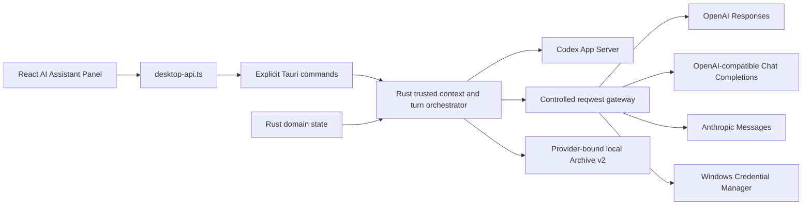

# Phase 6B/6C 多 Provider 只读 AI 架构

## 目标与边界

Phase 6B 把 AI 后端从单一 Codex App Server 扩展为一个由 Rust 统一编排的受控 Provider 层；Phase 6C 将模型目录、用户优先界面和本地工具资源接入同一边界。它仍然是只读解释助手：AI 不获得原始 PRJ、项目路径、Shell、MCP、通用文件系统、工具执行或直接写入能力；任何 Patch 仍必须经过既有结构化 Patch、Diff、确定性验证和用户确认边界。

## Provider 模型

`AiProviderProtocol` 只允许：

- `codex_app_server`：Codex 管理身份和目标。
- `openai_responses`：`POST <base>/responses`，使用严格 JSON Schema 和 SSE。
- `openai_chat_completions`：`POST <base>/chat/completions`，用于兼容 OpenAI 协议的 Provider。
- `anthropic_messages`：`POST <base>/messages`，使用 `x-api-key`、固定 `anthropic-version` 和 Messages SSE。

内置 Profile 使用确定性 UUID v5；自定义 Profile 使用 UUID v4，并且只能选择 OpenAI-compatible 协议。预设包括 OpenAI、Anthropic、Gemini、OpenRouter、DeepSeek、Ollama、LM Studio 和 vLLM。Phase 6C 使用统一 `AiProviderModelView` 目录结构；内置 Provider 的模型只来自官方目录/App Server，未知能力模型只进入高级区域，手动模型 ID 仅对自定义 Profile 的高级设置开放。

### 模型目录与缓存

Rust 通过既有 HTTPS/回环网关获取 Provider 目录：OpenAI 使用 `/v1/models` 并筛选 Responses 文本生成模型，Anthropic 支持 `has_more`/`last_id` 分页，Gemini 使用官方 `v1beta/models` 并筛选 `generateContent`。目录缓存只保留模型元数据，TTL 为 24 小时；写入 `ai/providers/model-catalog.json` 前不包含凭据、问题、回答、Authorization Header 或原始请求日志。刷新异常会返回上次成功列表并标记 `stale`，而不是清空选择器。

## 数据与凭据

- 非敏感 Profile 元数据写入 `app_local_data_dir()/ai/providers/profiles.json`，Schema `1.0`，严格拒绝未知字段、非法内置配置、重复 ID、超限文件和损坏内容。
- Profile 写入使用临时文件、`sync_all`、旧版本 `.json.bak` 保护和原子替换；读取失败不静默覆盖。
- API Key 只经过 `AiCredentialStore` 写入 Keyring 服务 `org.contamstudio.ai-provider`，条目用户名为 `profile:<profile_uuid>`。生产 Windows 实现映射到 Windows Credential Manager；其他平台测试实现 fail closed。
- Secret 类型不派生可打印明文的 Debug，HTTP Header 只在请求生命周期内从 `zeroize` 值生成。Secret 不进入 Profile JSON、Archive、错误、诊断、环境变量或前端 Reducer。

## 网络安全

Rust `url::Url` 负责解析和拼接端点。远程只允许 HTTPS；HTTP 只允许回环主机。Client 固定禁止重定向，不使用 Cookie Store；连接超时、响应体、SSE 事件、SSE 总量、空闲、Turn 总时长和取消均有界。HTTP 响应的工具调用、函数调用、错误事件、非法 JSON、超限数据和不完整终态均 fail closed。

发送前的上下文预览增加 Provider ID、名称、协议、目标 Origin、网络范围和模型 ID。Context Fingerprint 绑定可信上下文、作用域、语言、Provider、协议、配置修订、Origin、模型和生成选项，不包含 Secret。Preview、HTTP 历史和 Turn 必须匹配同一指纹；Provider、模型、Secret 或配置变化会清空旧绑定。

## Codex 登录扩展

Codex 保持现有本地 App Server 连接路径。`start_ai_provider_login` 只接受设备码或 API Key 两种闭合方式：

- 设备码只返回安全的登录 ID、HTTPS 验证 URL、用户码和状态；10 分钟本地过期，可取消。
- API Key 只传给 App Server 的 `account/login/start`，Studio 不再次保存；完成后重新读账号和模型目录。
- `account/login/completed`、`account/updated` 等空闲通知在账号刷新或新 Turn 前有界排空，不会进入 Turn 协议解析器。
- `logout_ai_provider` 调用 `account/logout` 并清除本地连接、目录、预览和会话状态。

## Archive v2

每条 v2 记录增加 `provider_profile_id`、`provider_display_name`、`provider_protocol` 和 `destination_origin` 不可变快照。旧 v1 条目先按严格旧 Schema 验证，再确定性标记为 Codex Profile 并通过旧版本保护、临时文件、同步和原子写入迁移；迁移失败保留原文件。Archive 视图仍按基线 SHA-256 和稳定 Zone UUID 过滤，不自动重放到模型。

## Phase 6C 工具与界面接线

构建脚本先从 NIST 官方下载页下载并校验锁定 ZIP，然后把运行时同步至 Tauri Resource 输入。`src-tauri/src/release.rs` 按“开发 override → 内置资源 → 旧版诊断路径”发现 ContamX/SimRead，并在启动前验证文件级 SHA-256。普通设置只显示就绪状态和版本；工具路径、旧版探测、资源诊断进入高级区域。本轮不提交 ZIP/EXE/DLL。

存储透明度命令只遍历固定 `app_local_data_dir` 白名单类别，使用 `symlink_metadata` 跳过符号链接并统计数量/字节数；不读文件正文、不扫描白名单外路径、不实现删除。

## 前端接线

`ai-state.ts` 只新增 Provider 状态，不引入第二套状态管理。面板提供 Provider 下拉、自定义 Profile、模型目录刷新、写入型 API Key、Codex 设备码/API Key 登录、登录取消/退出、目标位置披露、预览、发送、停止和本地档案；Endpoint、手动模型、Reasoning 和诊断位于可折叠高级设置。前端永不保存或回填 Secret；Tauri Wrapper 只提交命令所需的精确字段。

## 证据边界

本地 Mock 覆盖三个 HTTP 适配器、鉴权 Header、SSE、工具阻断、URL 和模型目录边界；Rust 覆盖 Codex 账号模式、设备码解析、通知队列和 Archive 迁移；前端覆盖安全 Preview/Archive、Wrapper Payload、Provider 状态和原有只读流程。用户于 2026-07-28 另行报告真实 Provider 请求、API Key 配置与使用、真实 AI 回答和 GUI 验收通过；仓库只保留该聚合结论，不保留凭据、账号、请求/响应内容，也不据此推断未逐项报告的 Provider、协议或设备码登录均已覆盖。安装器、干净机、签名和产品发布仍为 `not_run` 或未验证，当前状态以能力矩阵和 Phase 6B 验证记录为准。
