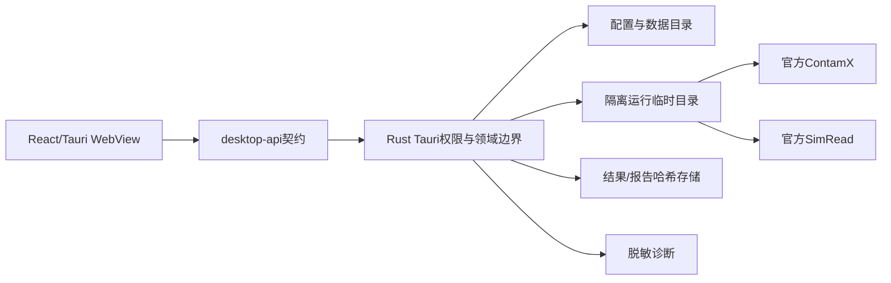

# AGENT-07 开发者交接

## 架构图



## 模块职责

- `src-tauri/src/release.rs`：版本信息、工具探测、配置schema迁移、目录边界、缓存清理和脱敏诊断。
- `src/app/release-state.ts`：前端payload校验、状态文案和诊断白名单。
- `src/components/workbench/ReleaseSettings.tsx`：首次启动向导、工具配置、关于和诊断操作。
- `scripts/build-release.ps1`：便携构建、清单和产物审计入口。
- `scripts/build-installers.ps1`：只检测NSIS/WiX，缺失时返回`blocked_environment`。
- `scripts/audit-release.mjs`：文件名、内容、用户路径和密钥扫描。

## 数据流与安全边界

1. 安装目录只包含应用资源；配置、工程、结果、日志和临时文件走Tauri用户目录。
2. 工具路径只从用户选择器进入，Rust只允许固定的ContamX/SimRead类型和固定`--version`参数。
3. 原始PRJ永不覆盖；Patch、运行和报告都在副本或独立临时目录中完成。
4. AI只接收结构化、哈希绑定、用户批准的安全证据，不能访问Shell、任意路径或完整二进制。
5. 诊断包使用字段白名单和类别化目录，不导出用户工程正文。

## 测试入口

```powershell
scripts\verify.ps1 -Mode Full
git diff --check
cargo fmt --all --manifest-path src-tauri\Cargo.toml -- --check
cargo clippy --manifest-path src-tauri\Cargo.toml --workspace --all-targets --all-features -- -D warnings
pnpm test
pnpm build
node scripts\tests\test-release-closure-contract.mjs
```

便携启动测试只针对`F:\\Codex_File\\artifacts\\contam-studio\\agent-07`下的隔离产物，不读取用户项目。

## 发布流程

1. 从干净`main`创建`codex/agent-07-release-closure`。
2. 运行版本一致性、Full、发布扫描和便携启动测试。
3. `release-closure.ps1`检测NSIS/WiX；缺失时记录`blocked_environment`，不安装工具。
4. 生成便携版、清单和脱敏诊断；检查`unsigned_build`。
5. 用户完成最终GUI和干净Windows验收后，才考虑主线合并、签名和正式交付。

## 已知限制

- 当前没有可用NSIS/WiX工具链，不能声称生成安装器。
- 当前构建未签名、未上传、未创建Release。
- 没有隔离干净Windows环境，安装、升级、卸载和SmartScreen只能记录为待验/阻塞。
- 本批不独立运行用户配置的ContamX/SimRead；官方工具状态依赖用户在设置页探测。
- Schedule/Species仍按已有安全边界在不能可靠Patch时只读降级。
