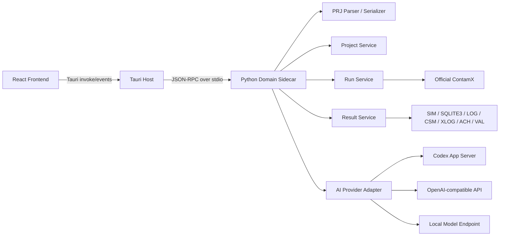
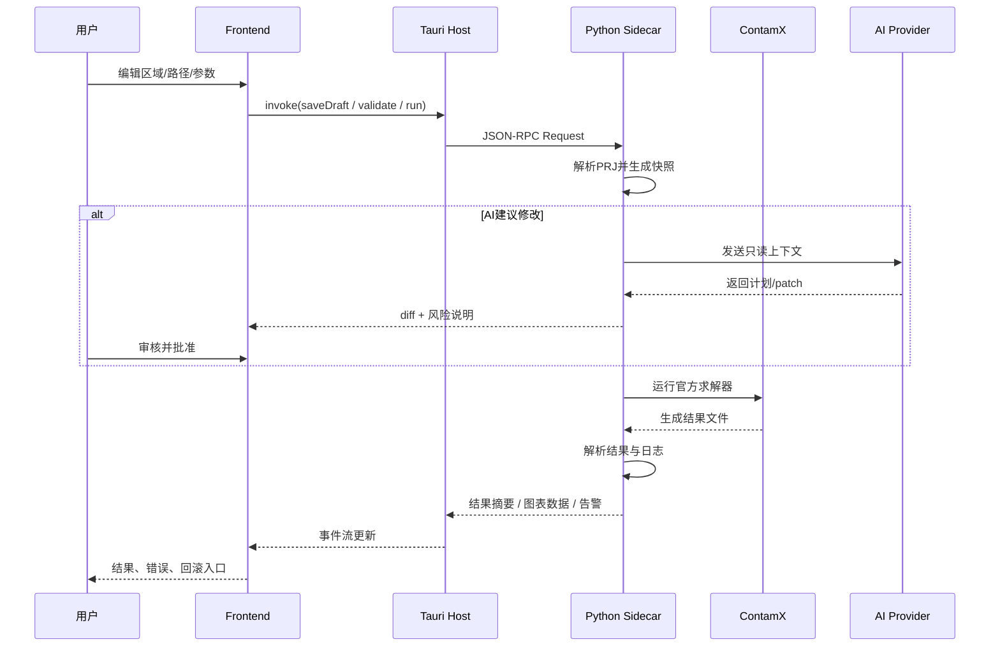

# CONTAM Studio 离线优先双语桌面应用完整项目设计报告

> 状态：历史研究、非规范。本文记录2026-07检索时的假设、建议和来源线索；当前能力、状态和执行顺序以[唯一能力状态矩阵](../capability-status-matrix.json)、[当前状态](../current-state.md)和[阶段路线图](../roadmap/phases.md)为准。不可恢复的内部引用统一标记为`source_pending`，不得作为当前实现或正式证据。

## 执行摘要

这份研究的核心结论很明确：**你不应该重写 CONTAM 的求解器，而应该做一个“CONTAM Studio”外壳层，继续调用官方 ContamX 作为 solver，把主要工程投入放在现代 GUI、离线工作流、项目解析与结果可视化，以及可控的 AI 助手上。** 这条路线同时符合官方技术演进方向，也最符合单人开发的时间与风险约束。官方资料显示，CONTAM 一直由 NIST 持续开发，当前仍在更新；ContamW 本质是图形界面，ContamX 本质是可独立运行的求解引擎；近年又新增了 CONTAM APIs、Python 绑定 `contamxpy`，以及面向算法辅助设计的 ANT 插件，这些都说明“在官方 solver 外面做更好的建模/交互层”是合理且被验证过的方向。source_pending

从版权与合规角度看，这条路线也更稳。NIST 官方免责声明明确写明：CONTAM 由美国联邦雇员在公务中开发，依据美国法典第 17 编第 105 条，不受版权保护、属于公有领域；允许自由再发布和修改，但衍生作品需要标明来源和修改事实。与此同时，CONTAM 中特定求解器组件如 CVODE 仍带有单独的版权/再分发条款，因此如果你分发含官方二进制的安装包，就必须把这些 notices 一并带上。source_pending

你这个项目**有明确用户价值，但用户群会是“高价值小众”而不是大众市场**。NIST 维护了 CONTAM 用户组，当前公开页面可见约 395 个讨论主题，且 2026 年仍有关于 co-simulation、温度调度、烟控、压力 relief damper 等活跃问题；NIST 还持续维护教程、结果查看器、结果导出工具、参数化工具和与 EnergyPlus 的联动工具；另外，中文学术语境中也能找到使用 CONTAM 的硕博论文和室内空气品质研究。这些信号说明：**学生、教师、研究人员**作为首批目标用户非常合理，他们对“更好看、更顺手、更容易和 AI 协作”的需求不是伪需求。source_pending

因此，最可执行的建议不是“从底层算法重构 CONTAM”，而是分三步走。第一步做 **Windows-first、离线优先、zh-CN/en 双语、调用官方 ContamX 的 Studio**；第二步补强 **解析/回写稳定性、批量运行、结果诊断与 AI patch 审批链**；第三步再考虑 **MCP、插件系统、EnergyPlus/DeST 外部联动、三维建模入口**。从单人可行性上看，只要严格控 scope，把 MVP 限定在“常见教学/科研建模对象 + 结果分析 + AI 辅助编辑”，项目是可做的。真正的成败点不在“大模型接入”，而在 **PRJ 解析与回写的稳健性、未知字段保真、以及每次修改都有可回滚的快照与运行证据链**。这些点也是本报告后文的设计重心。source_pending

## CONTAM 现状与产品机会

CONTAM 官方定义非常清楚：它是一个**多区域室内空气质量与通风分析程序**，用于求解建筑中的空气流动、污染物浓度以及人员暴露；它既可用于一般通风与 IAQ 分析，也被大量用于烟控系统设计与分析；同时它还能和 EnergyPlus、TRNSYS 等工具做耦合。NIST 2020 手册与官方介绍页都强调了这三类核心能力。source_pending

历史上，CONTAM 由 NIST 自 20 世纪 80 年代起持续开发。官方 2026 API 论文指出，CONTAM 自 1980s 起连续演进；2020 用户手册致谢部分则点名了历史贡献者与重要技术分支来源，包括 George N. Walton、James W. Axley、Liangzhu Wang 的 CFD 能力、以及 David Lorenzetti 对求解器与 CVODE 集成的贡献。当前 NIST 公开页面中，Steven Emmerich、William Stuart Dols、Brian Polidoro 仍是官方联系人；其中 2020 版用户手册作者为 Dols 与 Polidoro。source_pending

截至本次检索日期，官方最新版本页面显示：**CONTAM 3.4.0.8** 于 2026-01-08 发布；ContamW 安装器仍是 **32-bit Windows**，而 **ContamX 64-bit 3.4.0.3** 则提供 Windows 64-bit 与 Linux 64-bit 包。最新修复包括“单项目中可定义污染物数量上限”的问题。这个版本态势本身就提示了一个机会：**官方 solver 仍在维护，但 GUI 体系仍然带有历史包袱，Studio 层重做体验非常有意义。**source_pending

更重要的是，官方技术路线已经在向“外部工作流嵌入”开放。2026 年论文说明，原来用户友好的建模方式几乎只有 ContamW，那种二维、直角化的 whole-building floor plan 建模方式限制了 CONTAM 与 3D 平台、批处理和城市尺度分析的结合；而新的 APIs 正是为“创建/修改模型”和“动态驱动运行、查询结果”而开发的。论文还明确指出，ContamW + ContamX 的二元结构，使得“独立于 GUI 的运行”天然适合被其他框架调用。这个判断几乎就是对 CONTAM Studio 产品方向的直接背书。source_pending

从生态配套看，NIST 不只提供主程序，还提供了比较完整的外围工具：ContamRV 看结果、Results Export Tool 做导出/均值/暴露处理、ContamFactorial 生成参数化 PRJ，以及 EnergyPlus-CONTAM multiprocessing 工具。官方还保留了输入数据资源库，支持 airflow elements、WPC、filters、schedules 等共享。也就是说，你做 Studio 不是要“凭空发明需求”，而是把现有散落的实用能力重新组织到一个统一工作台里。source_pending

“会不会有人用”这个问题，证据也比直觉更乐观。NIST 用户组页面说明其 Google Group 用于 discussion、support、announcements，而公开组页面在 2026 年仍有持续对话；讨论内容覆盖 ContamFMU、楼梯间加压、balanced terminals、deep underground parking smoke-control、dynamic indoor temperature schedule 等，说明它不是“只有下载没有交流”的死工具。与此同时，Rhino/Grasshopper 方向已经出现 ANT 这种“算法辅助设计入口”，其论文明确说它基于 CONTAM 用于空气传播风险、暴露、参数分析与优化；这再次说明更高层的建模入口能显著降低门槛。source_pending

结合这些事实，我的判断是：**CONTAM Studio 的最佳定位不是“通用 BIM 平台”或“新的楼宇仿真内核”，而是“面向教学与研究、可离线工作、可审阅可回滚、可被 AI 安全协助的 CONTAM 建模与分析工作台”。** 这样的定位足够窄，单人也有机会做成；同时又足够实用，能真正服务你设定的学生、教师、研究人员三类首批用户。这个判断是基于官方架构开放度、用户社区活跃度以及现有工具碎片化现状做出的综合推断。source_pending

## 产品愿景与 MVP 范围

我建议把产品愿景压缩成一句话：**“CONTAM Studio 是一个离线优先的、双语的、现代化的 CONTAM 项目工作台；它不替代 ContamX，而是让人和 AI 更安全、更高效地使用 ContamX。”** 这样定义有三个好处。第一，它天然避免“重写 solver”这个高风险陷阱；第二，它把价值集中在 GUI、流程、协作和结果洞察；第三，它可以和官方 API、`contamxpy`、未来的 ContamP/contampy 保持兼容而不是对抗。source_pending

MVP 的优先级应该围绕“最常见教学/科研建模链路”来排，而不是按 CONTAM 全功能目录机械覆盖。官方手册列出的项目组件非常多，从 levels、zones、airflow paths、simple AHS、ducts、controls、species/contaminants、sources/sinks、filters、kinetic reactions、occupant exposure，到 weather、wind、schedules、results、annotations，再到 TRNSYS 和 EnergyPlus 耦合。单人首版如果企图全部可编辑，风险会直接集中爆炸；尤其 1D zones、CFD、short time step、复杂 ducts 与 controls，既涉及更高的数值复杂度，也涉及更特殊的结果文件。source_pending

因此，正确做法不是“全部能改”，而是“**全部能打开，尽量不丢；高频对象先可编辑，低频复杂对象先只读+保真保存**”。在 PRJ 这类格式上，这是决定项目成败的策略。NIST 在 PRJ File Format 附录里清楚给出了 section 结构；同时官方手册也提醒很多对象编号会在保存时被重排，例如 airflow path number、duct segment number、source/sink number、occupant number 等。因此，你要围绕**内部稳定 ID**和**lossless passthrough**建模，而不是围绕官方显示编号建模。source_pending

下表中的“支持对象”来自 NIST 手册目录、PRJ 附录和结果文件说明；“是否可编辑”则是按**单人开发 + 教学科研首批用户 + 离线优先**这三个约束给出的推荐实现范围。source_pending

| 对象域 | MVP 支持 | 首版状态 | 设计说明 |
|---|---|---|---|
| 项目元数据、天气、仿真控制、输出控制 | 高优先 | **可编辑** | 这是运行链路的入口，且直接决定结果文件生成方式；应在首版完整支持。 |
| Levels 与 Zones | 高优先 | **可编辑** | 是教学与论文示例里最核心的空间层。 |
| Airflow Paths 与常见 Airflow Elements | 高优先 | **可编辑** | 是 CONTAM 的主干对象；Studio 的视觉价值主要也体现在这里。 |
| Schedules、WPC、Filters、常见 Library 引用 | 高优先 | **可编辑** | NIST 官方提供了共享库与 Library Manager 场景，首版应支持。 |
| Species / Contaminants、Source / Sink、基础 Kinetic Reactions | 中高优先 | **可编辑** | 服务 IAQ、暴露与课程设计的主要分析任务。 |
| Simple AHS | 中高优先 | **可编辑** | 手册单列章节，且是许多住宅/教学案例足够用的机械系统层。 |
| Results、annotations、run history | 高优先 | **可读/可导出** | 这是 Studio 差异化的重点，不是单纯“跑起来”。 |
| Ducts | 中优先 | **只读 + 高亮检查** | 手册单列章节且与复杂结果关联更重，建议 M1 后再进入编辑。 |
| Controls | 中优先 | **只读 + Inspector** | Controls 与调度、报告节点、co-sim 都会交叉；先看得懂、先不随便写。 |
| Occupant Exposure | 中优先 | **只读 + 结果查看** | 先保留导入与结果呈现，后续再做图形编辑。 |
| 1D zones、Short Time Step、CFD 相关 | 低优先但必须兼容 | **只读 + 原样保留** | 官方说明 STS 需要显式短时步并产生额外结果文件，首版不应编辑。 |
| TRNSYS / EnergyPlus 耦合资产、FMU 辅助文件 | 低优先但必须兼容 | **只读 + 原样保留** | 先不深度集成，但绝不能在保存时破坏这些项目。 |

在功能上，我建议 MVP 只做下面这些可落地能力：项目打开/保存、对象导航、区域与路径图形编辑、属性表单、运行配置、单次/批量运行、结果曲线与表格、错误日志诊断、快照与回滚、AI patch 审核。只要这几块做好，产品已经足够成为“课程设计与科研工作台”，而不是一个漂亮但空心的壳。官方工具生态也说明，结果查看、导出和批处理本来就是 CONTAM 工作流的重要组成。source_pending

## 架构设计与 AI 助手方案

从单人开发的效率、离线优先要求，以及现有 CONTAM Python 生态可用性来看，**最推荐的总体架构是：Tauri 宿主 + React/TypeScript 前端 + Python Domain Sidecar + 官方 ContamX Solver**。Tauri 官方架构页说明，它用 Rust 与系统 WebView 组合来做桌面应用，前端与本地能力通过消息传递连接；Tauri 还官方支持 sidecar 外部二进制，这正适合把 Python 作为领域逻辑与 AI 集成层。与此同时，`contamxpy` 官方 PyPI 页面已经明确提供了对 ContamX API 的 Python 绑定。source_pending

### 推荐技术栈

| 层 | 推荐 | 说明 |
|---|---|---|
| 桌面壳层 | **Tauri 2 + Rust** | 负责窗口、菜单、文件对话框、安装包、能力边界、sidecar 生命周期。 |
| 前端 | **React + TypeScript + Vite** | 与 Tauri 组合成熟，便于做复杂状态界面。 |
| 图形建模 | **React Flow** | 官方定位就是 node-based editors / interactive diagrams，支持 custom nodes 和 runtime auto layout。 |
| 组件系统 | **shadcn/ui + Tailwind** | “Open Code / AI-Ready / Beautiful Defaults” 很适合你的 AI+桌面工作台定位。 |
| 表格 | **TanStack Table** | Headless，便于完全自定义科研/工程软件的表格样式与交互。 |
| 国际化 | **i18next** | 可做 namespace、JSON 翻译、Intl 格式化，适合双语桌面应用。 |
| 文本与 Diff | **Monaco Editor** | 官方即 VS Code 同源编辑器，适合 patch 审核和高级属性编辑。 |
| 领域逻辑 | **Python 3.11+ sidecar** | 便于接 `contamxpy`、未来 contampy、结果分析、AI provider。 |
| 原始求解 | **官方 ContamX** | 不重写求解器，只做发现、调用、封装、结果回收。 |

上述选择不是“流行技术拼盘”，而是围绕你这个项目的三个硬要求来的：**深度定制 UI、AI 易读写、与 CONTAM 现有 Python/API 资源兼容**。React Flow 官方强调 custom nodes 可以内嵌表单、图表等元素；TanStack Table 和 shadcn/ui 则分别解决“数据网格逻辑”和“可被 AI 修改的开码组件”；i18next 能把双语内容按 namespace 拆开，适合工程软件的术语密集界面。source_pending

### 总体架构图



这个架构的关键不是“前后端分层”本身，而是**能力边界**。Tauri 官方安全文档说得非常清楚：capabilities 决定哪些 permissions 对哪些 windows/webviews 生效；remote URLs 默认不是主要用法，而且给远程内容本地系统权限会有安全风险。你做离线优先，恰好可以充分利用这个默认安全姿态：前端永远只访问本地 app，绝大多数系统能力由 Tauri/Rust 控，Python sidecar 则只暴露有限的 JSON-RPC 方法。source_pending

### 数据流图



### AI 助手的能力边界

你的 AI 助手不应该一上来就是“万能聊天框”，而应当是**带权限层级的工程代理**。OpenAI 官方资料显示，Codex app-server 面向 rich client integration，包含 authentication、conversation history、approvals、streamed agent events；Codex Python SDK 则通过 JSON-RPC 控制本地 app-server，这和你“Python sidecar 作为协调层”的设计天然兼容。官方还说明，Codex 本地客户端可用 ChatGPT 登录或 API key，两种方式都适用于本地工作；但 OpenAI Help Center 同时明确说明，ChatGPT 订阅与 API 平台是分开计费、分开管理的。因此你的产品设计不能把商业路径锁死在某一种 OpenAI 认证方式上。source_pending

我建议把 AI 权限分成五层：

| 权限层 | 能做什么 | 默认 |
|---|---|---|
| 只读解释 | 读当前项目摘要、对象属性、运行日志、结果表 | 开 |
| 生成建议 | 输出方案、生成 patch、给出风险说明 | 开 |
| 应用到草稿 | 把 patch 应到临时草稿，不覆盖主文件 | 需确认 |
| 运行求解 | 启动 ContamX、生成 run manifest、读结果 | 需确认 |
| 写外部文件 / 调本地命令 | 导出文件、调用 sidecar 工具、访问敏感目录 | 默认关 |

这个“分层权限 + 明确审批”设计，既呼应了 Codex 的 approvals 思路，也和 Tauri capability 模型一致。后续如果你真的要接 MCP，官方文档也已经给了按 server、按 tool、按 read-only 与 writes 分类审批的配置思路；但这件事完全可以留到第二阶段，不应该进入首发 MVP。source_pending

### 建议的 AI 工具集与 patch 工作流

我建议 AI 的工具集只暴露语义级能力，不暴露“任意 shell”：

```ts
// 只展示接口意图，不是最终实现
getProjectSummary(projectId): Summary
getObjectGraph(projectId): GraphSnapshot
findObjects(projectId, query): ObjectRef[]
proposePatch(projectId, instruction): ProposedPatch
applyPatchToDraft(projectId, patchId): DraftId
validateProject(draftId): ValidationReport
runProject(draftId, runOptions): RunId
getRunManifest(runId): RunManifest
queryResults(runId, metrics, filters): ResultTable | TimeSeries
exportResults(runId, format, targetPath): ExportReceipt
explainError(runId, xlogSegment): Diagnosis
```

工作流必须是：**AI 先读上下文 → 输出计划 → 生成 patch → 用户看 diff → 应到 draft → validate → run → 用户决定是否合并到主分支**。不要允许 AI 直接对主项目执行“静默覆盖”。Monaco 官方就是 VS Code 同源编辑器，天然适合 patch/diff 审查；而且你这个场景的“可审查性”比“自动化程度”更重要。source_pending

## UI 与交互规范

你想要的“现代化、好看、离线、旁边有 AI 助手、支持中英文切换”的理想形态，其实非常适合借鉴 **VS Code 的空间分区** 与 **OMEdit 的建模—仿真—绘图透视图**。VS Code 官方 UI 文档把界面分为 Activity Bar、Primary/Secondary Sidebar、Editor、Panel、Status Bar 六个基本区；OMEdit 的用户指南则明确区分了 Modeling Perspective、Plotting Perspective 和 Debugging Perspective。对 CONTAM Studio 来说，这两套思路非常契合：左侧是模型与资源导航，中间是画布/编辑器，右侧是属性与 AI，底部是运行、问题、结果。source_pending

iturn21image0turn21image1turn21image2turn21image3

### 推荐布局

我建议默认窗口采用五区布局：

1. **左侧主导航栏**：项目、对象树、库、批量运行、结果集。
2. **中央主编辑区**：画布模式 / 表单模式 / 原始 PRJ 模式 三种标签页。
3. **右侧上下文边栏**：属性检查器、AI 助手、差异审阅。
4. **底部面板**：问题列表、运行日志、结果表、任务进度。
5. **底部状态栏**：语言、单位制、solver 版本、dirty 状态、AI 当前模式。

这种结构几乎完全借鉴了 VS Code 的工作台模式，但内容是工程软件语义。VS Code 文档还特别强调启动时恢复上次 folder、layout、opened files 的状态；这条经验应直接借过来，因为科研类软件通常是“长会话连续工作”。source_pending

### 关键页面规范

**项目首页** 不要做成空白页，而要做成“最近项目 + 新建向导 + 模板 + 环境检查”。ANT 和官方教程生态都说明，CONTAM 用户很依赖示例与现成 case；所以首页应该直接提供“住宅自然通风”“教室 CO₂”“负压病房”“基础烟控”这类模板。source_pending

**建模画布页** 应允许在同一模型上切换三种视图：Sketch 视图、连接表视图、原始 PRJ 段视图。React Flow 适合承担 Sketch 视图，因为它本来就是 node-based editor，并且 custom nodes 可嵌入表单和图表；表视图则利用 TanStack Table；原始视图则用 Monaco。这样做能同时满足“入门用户喜欢拖拽”和“高级用户想精确看文本”的两类需求。source_pending

**结果页** 应该分成“总览、时间序列、空间分布、导出”四个标签。NIST 官方 Results Viewer 已经证明二维平面着色+瞬态动画是有效的；Results Export Tool 则证明文本导出、浓度时空平均、暴露处理、EnergyPlus infiltration 输出都是真实使用场景。Studio 不必一比一复制两款官方工具，但应该把它们的高频能力内聚成一个统一结果工作台。source_pending

**AI 助手页** 要有明确的“模式切换”，至少分为“解释模式、建议模式、补丁模式、诊断模式”。不要把所有权能混成一个输入框。输入区上方要始终显示当前读取上下文范围、是否可运行 solver、是否允许写文件、当前 provider，以及审批模式。这样用户不会对 AI 到底“看到了什么、能做什么”产生不确定感。这个设计既来自 Codex 的 approval 思路，也来自工程软件对可审计性的需求。source_pending

### 双语与主题策略

双语实现建议采取 `common / domain / results / assistant / errors` 五个 namespace。`common` 存按钮和通用文案，`domain` 存 zones/paths/AHS 等专业词汇，`results` 存图表与导出字段，`assistant` 存 AI 系统提示和交互文案，`errors` 存校验与运行错误。i18next 官方支持 namespace，把翻译拆成多个文件；它还支持基于 `Intl` 的格式化，因此时间、数字、单位显示都可以按 locale 统一处理。source_pending

主题上建议只做 **浅色 / 深色 / 高对比度** 三套，不要首版做过度皮肤化。状态栏、错误色、警告色、成功色应尽量克制。VS Code 的 status bar 指南明确反对滥用自定义颜色，并强调 workspace 级状态与上下文级状态的左右分布。这一套经验非常适合迁移到工程应用的底部状态栏。source_pending

## 工程实现要点与合规边界

### 解析与序列化方案

CONTAM Studio 最难的不是界面，而是 **PRJ 解析/回写**。NIST 手册 Appendix A 给出了 PRJ File Format 的 section 划分：项目/天气/仿真与输出控制、species 与 contaminants、level/icon data、day/week schedules、WPC、kinetic reactions、filter elements、filters、source/sink elements 等。这说明 PRJ 适合做**分段解析**，而不是一上来就做“大一统 AST”。source_pending

我建议做两层数据模型。第一层叫 **LosslessDocument**，负责保存 section 原文、注释、未知记录、源位置映射；第二层叫 **SemanticProject**，只针对首版支持对象做 typed projection。前端所有编辑都作用在 `SemanticProject`，保存时再 merge 回 `LosslessDocument`。这样做的意义是：即便首版暂不支持 ducts/controls/1D zones，也能做到**打开—查看—保存不破坏**。这对单人项目来说，比“所有对象全可编辑”更重要。这个设计是对 PRJ section 化结构的直接利用。source_pending

Round-trip 测试不要追求“字节级相等”，而要追求“**语义等价 + 未修改区块原样保留**”。因为官方手册明确说，很多对象的编号在每次保存时都会被重排，例如 airflow path、duct segment、source/sink、occupant 等；所以如果你拿文件字节 diff 当唯一判据，会得到大量假失败。正确做法是定义“标准化比较”：按名称、楼层、位置、连接关系、引用关系比较，而不是按显示编号比较。source_pending

建议的 spike 计划如下。第一周只做 lexer + section splitter；第二周完成 `Project/Weather/Simulation/Output` 与 `Levels/Zones/Paths` typed model；第三周做到 open-save no-op 保真；第四周加 schedules / filters / simple AHS；第五周引入“未知 section passthrough”；第六周建立 golden corpus 与 normalize comparator。golden corpus 以 NIST demo、教程案例、你自己的课程设计项目、含 controls/ducts/1D 的复杂样本共同构成。官方教程、手册与用户组都能为这些样本提供来源。source_pending

### 求解器发现、版本管理与运行清单

官方手册说明，PRJ 可以直接供命令行使用；为确保文件“well formed”，可先用 ContamW 的 Run Building Check 或直接运行仿真。下载页则说明当前官方分发中包含 ContamW、ContamX、simread、simcomp、prjup 等相关工具。因此 Studio 不应该直接在用户工作目录“裸跑”，而是要有独立的 **Run Workspace** 和 **Run Manifest**。source_pending

建议的 solver 发现顺序是：**用户配置路径 → Bundled solver → 常见安装目录 → PATH → 让用户手动确认**。版本支持因为需求未指定，建议首版明确标注“主支持 CONTAM 3.4 系列，基准测试版本为 3.4.0.3 solver / 3.4.0.8 bundle；更旧项目 best-effort 导入并弹出 warning”。这个策略既与当前官方发布一致，也避免你在首版背大量历史兼容债。source_pending

`RunManifest` 建议至少记录这些字段：

```json
{
  "runId": "uuid",
  "projectSnapshotId": "uuid",
  "solverPath": "C:/.../contamx3.exe",
  "solverVersion": "unspecified-or-detected",
  "solverSha256": "....",
  "inputFiles": ["model.prj", "weather.wth", "ambient.ctm"],
  "startedAt": "ISO8601",
  "finishedAt": "ISO8601",
  "exitCode": 0,
  "stdoutLines": 123,
  "stderrLines": 0,
  "outputs": {
    "sim": "run/model.sim",
    "sqlite3": "run/model.sqlite3",
    "xlog": "run/model.xlog",
    "csm": "run/model.csm",
    "ach": "run/model.ach",
    "val": "run/model.val"
  }
}
```

这里最重要的不是 JSON 长什么样，而是**每次运行都绑定一个不可变快照**。这样 AI 改了什么、用户批准了什么、运行用的是哪个 solver、结果来自哪份 PRJ，全部可追溯。

### 结果解析与可视化

官方手册说明，详细结果保存在 `.SIM` 中，这是二进制文件；同时，CONTAM 也能把相同数据写到 `.SQLITE3` 数据库里。SIM/SQLITE3 都包含 flow links 的 airflow 与 pressure difference、airflow nodes 的 reference pressure/temperature，以及 contaminant nodes 的 concentration；而 `LOG` 是 report control nodes 输出，`CSM` 是污染物源汇总，`VAL` 是 airflow/pressurization validation test，`XLOG` 则主要是运行性能与诊断日志。source_pending

因此，首版结果层最好的做法是：**默认鼓励输出 SQLITE3，并把它当作 Studio 的首选图表数据源；SIM 作为兼容保底；XLOG/CSM/VAL/ACH/LOG 走补充解析。** NIST 手册直接写明 `.SQLITE3` 包含与 `.SIM` 相同的数据，这会显著降低你自己硬啃二进制格式的复杂度。source_pending

首版该支持的指标建议是：

| 类别 | 必做指标 | 原因 |
|---|---|---|
| 气流 | path airflow、pressure difference、whole-building ACH | 最常用，也最接近教学/通风设计核心。 |
| 区域 | zone pressure、temperature、contaminant concentration | 最适合做趋势图和空间着色。 |
| 暴露 | occupant exposure summary | 教学与感染风险分析常用。 |
| 质量守恒/源汇 | source/sink mass、filter loading / challenge、exfiltration | 有助于解释“为什么浓度变化成这样”。 |
| 诊断 | solver log、warnings、validation outputs | 让 AI 有东西可解释，而不只是报错代码。 |

这套指标基本覆盖了官方 Results Viewer、Results Export Tool 和手册章节里的高频结果形态。官方导出工具还额外说明了五类输出能力：把 `.sim` 导成文本、做时间/空间平均、处理暴露结果、生成 whole-building infiltration 给 EnergyPlus、生成 zone-specific infiltration 给 EnergyPlus。这意味着你的 Studio 首版导出格式至少应该支持 **CSV/TSV、JSON、PNG/SVG 图、项目报告 Markdown**；而 EnergyPlus infiltration 导出可以先列入第二阶段。source_pending

### 撤销、重做与快照模型

我建议把撤销系统做成 **Command + Transaction + Snapshot** 三层：

- `Command`：单一语义更改，例如“修改 Zone 3 体积”“把 Path 12 连接到 Ambient”
- `Transaction`：一次用户操作或一次 AI patch 的复合更改
- `Snapshot`：可运行、可导出、可回滚的完整项目状态

一个典型例子是 AI 产生“把三间教室午后 occupancy schedule 改为同一模板并新增 CO₂ 源项”。这在 UI 层可以被视为一个 transaction，但底层可能是 7 个 command。用户点击“撤销”时撤销 transaction；想回到运行前状态时则回滚到 snapshot。因为 PRJ 回写与运行文件输出本身是重操作，所以 snapshot 必须是一等公民，而不是附带功能。

### 安全、隐私与版权

离线优先不是一句口号，而是安全设计基线。Tauri capability 文档指出，默认主要场景是本地内容；配置 remote URLs 使用本地能力时要格外谨慎。Tauri 文件系统插件也明确写明：潜在危险命令默认被阻止，必须显式在 capability 中开启。对 CONTAM Studio 来说，这意味着前端只拿最少权限：读写用户选择的项目目录、运行 sidecar、打开保存对话框；任何更广泛的 FS 与 shell 权限都应默认禁用。source_pending

AI 隐私策略建议写成产品硬约束：**默认不开启联网 AI；AI provider 由用户手动配置；发送到模型的上下文可预览；PRJ、日志、结果集的上传开关默认关闭；API key 不写入项目文件、不写入日志。** 这部分更多是产品设计要求，但它与 Tauri 的最小权限模型和 Codex 的 approval 流是相容的。source_pending

版权层面需要区分三类资产。第一类是 CONTAM 官方主体：公有领域，可派生，但要保留来源与修改说明。第二类是 CONTAM 内含的特定第三方组件，例如 CVODE：需要随安装包附带对应 notice。第三类是你自己的 UI 与整合代码：建议直接采用 **MIT 或 Apache-2.0**，同时把 bundled notices 收进 `THIRD_PARTY_NOTICES`。如果你在安装包里捆绑官方 ContamX，就要在 installer 与 About 页里分别说明“solver 来自 NIST 官方发布，Studio 不是 NIST 官方产品”。这样既合法，也避免“官方背书”误解。source_pending

### 测试与打包计划

测试策略建议分四层。第一层是 parser 单测与 golden round-trip；第二层是 runner 集成测试，验证 run manifest、结果文件映射、失败恢复；第三层是 UI 回归测试，覆盖项目打开、patch 审核、运行、导出；第四层是 AI contract 测试，只验证工具协议、审批流与 patch schema，不依赖模型质量。这个分层能把“解析错误”“运行错误”“界面错误”“模型回答差”四种问题拆开定位。

打包上，Windows-first 是最合理的。Tauri 官方文档说明可以在 Windows 上通过 `tauri build` 生成安装器；Updater 文档又说明 Windows 会生成 NSIS 与 MSI 相关构件。对你的首发用户——学生、教师、研究人员——我的建议是：**主推 NSIS 安装器，保留 MSI 供学校机房/实验室统一部署**。如果以后要降低 SmartScreen 摩擦，再补代码签名；Tauri 签名指南也说明，Windows 代码签名不是运行所必需，但能减少用户忽略警告的成本。source_pending

## 路线图、资源估算与风险

### 里程碑建议

| 里程碑 | 目标 | 预计投入 | 退出标准 |
|---|---|---:|---|
| 研究与原型 | 跑通架构最小闭环 | 2 周 | 能打开 PRJ、显示 zones/paths、调用 ContamX 跑一个案例 |
| 解析内核 | 建立 lossless parser + typed projection | 3 周 | 常见 3.4 项目 open-save 不破坏、未知 section 可保留 |
| 编辑器 MVP | 画布、属性面板、项目树、双语基础 | 3 周 | 能完成一次从新建/修改到运行的教学案例 |
| 结果工作台 | SQLITE3/SIM 结果读取、图表、日志诊断 | 2 周 | 能看趋势图、导出 CSV/JSON、定位主要报错 |
| AI 助手 Beta | 只读解释、propose patch、diff 审核 | 2 周 | AI 只能改草稿，不能静默覆盖主项目 |
| 打包与稳定化 | 安装器、自动更新预留、文档、样例 | 2 周 | 给 5–10 名真实用户试用并修完 P0 问题 |

如果按每周 15–20 小时的“高强度学生兼职节奏”来估，MVP 大约需要 **14–18 周**；如果你能拿到更稳定的开发时间，或者大量使用 Codex 帮你写 UI/样板代码，压到 **10–12 周**是有可能的。这里的先决条件是：**不要在首版碰 controls 编辑、ducts 编辑、1D zones 编辑和复杂 co-simulation。**

### 风险矩阵

| 优先级 | 风险 | 表现 | 缓解方案 |
|---|---|---|---|
| P0 | PRJ 回写破坏项目 | 保存后官方 solver 不再能跑 | 双层模型、未知 section passthrough、golden corpus、只对支持对象落盘 |
| P0 | 以官方显示编号作为主键 | object diff 混乱、回滚困难 | 内部全部用 UUID；官方编号只作展示，因为保存会重排 source_pending |
| P0 | AI 直接覆盖工程文件 | 用户信任崩塌、结果不可追溯 | 强制 draft + diff + approval + snapshot |
| P0 | 把产品绑死在某一 AI 计费模式 | 上线后无法让用户真正接入 | provider adapter 抽象；Codex/App Server 与 OpenAI-compatible 并存；不要假设 ChatGPT 订阅等于 API 能力 source_pending |
| P1 | 版本碎片 | 旧 PRJ 导入异常 | 首版只主支持 3.4 系列，旧版 best-effort 并弹警告 source_pending |
| P1 | 复杂对象范围失控 | ducts/controls/1D 让项目拖垮 | 首版只读保真，后续按专题迭代 source_pending |
| P1 | 结果解析太依赖 SIM | 二进制逆向负担大 | 优先走 SQLITE3，其数据与 SIM 等价 source_pending |
| P1 | Windows 权限过宽 | 本地安全面过大 | Tauri capability 最小化，不开放 remote、本地 FS 精准 scope source_pending |
| P2 | UI 做得像 Web 表单工具 | 工程软件体验不专业 | 借鉴 VS Code + OMEdit 的分区与透视图 source_pending |
| P2 | 结果页只会画折线图 | 难形成差异化 | 加平面着色、表格联动、日志诊断、导出工作流，借鉴 ContamRV 与 Export Tool source_pending |

## 推荐学习材料与 Codex 启动脚手架

### 优先研究的开源项目与论文

这份清单不是“多读点资料”，而是按你项目中每一个关键难点对应给出“最该看的原型”。

| 资料 | 为什么必须看 | 你要直接借什么 |
|---|---|---|
| **NIST TN 1887r1 CONTAM User Guide 3.4** | 这是对象模型、结果文件、PRJ 附录、socket appendix 的总源头 | object taxonomy、文件格式、结果文件语义、术语表 source_pending |
| **Download CONTAM 页面** | 给你当前支持版本与发布事实 | 版本基线、安装器与 solver 包规划 source_pending |
| **CONTAM Software Disclaimer** | 决定你能不能分发、怎么分发 | 公有领域声明、衍生作品标识、CVODE notice source_pending |
| **Development and Application of CONTAM APIs 2026** | 直接告诉你官方为何做 API、过去为什么难用 | “不要重写 solver，只做新工作流入口”的论据；ContamP/ContamX API 方向 source_pending |
| **contamxpy PyPI 页面** | 这是 Python sidecar 的最现实抓手 | co-simulation 能力边界、多运行线程安全、demo case 组织方式 source_pending |
| **contampy / ContamP 相关公开材料** | 它是未来“语义编辑而不是手改 PRJ”的关键方向 | 先把它当 future path，不要首版强依赖；目前更像发展中资产 source_pending |
| **ANT 2024** | 这是“降低 CONTAM 门槛”的最近邻案例 | Rhino/Grasshopper 入口、算法辅助设计、批处理与优化故事线 source_pending |
| **React Flow 官方文档与例子** | 画布编辑器直接照着学最快 | custom nodes、auto layout、graph state pattern source_pending |
| **Tauri 2 官方架构、capabilities、sidecar、installer** | 决定桌面壳是否安全、是否好发包 | sidecar 权限、窗口能力、NSIS/MSI、最小权限架构 source_pending |
| **OpenModelica OMEdit 用户指南** | 这是“仿真 GUI 应该怎么组织”的绝佳参照 | 建模/绘图/调试视图切换、左树右编辑的工作台形态 source_pending |
| **VS Code UI / UX / Status Bar 文档** | 这是现代桌面工作台交互模板 | activity bar、sidebar、panel、status bar、command palette、状态恢复 source_pending |
| **Codex App Server / SDK / Auth 文档** | 决定 AI 助手到底怎么嵌进去 | app-server deep integration、JSON-RPC、本地 auth、approval 模式 source_pending |

### 推荐的项目目录结构

下面这套目录是为了让 Codex 一上来就能开始写，而不是先花很多额度替你思考“该怎么分层”。

```text
contam-studio/
├─ apps/
│  ├─ desktop/
│  │  ├─ src/
│  │  │  ├─ app/
│  │  │  │  ├─ router/
│  │  │  │  ├─ providers/
│  │  │  │  └─ store/
│  │  │  ├─ features/
│  │  │  │  ├─ project/
│  │  │  │  ├─ canvas/
│  │  │  │  ├─ inspector/
│  │  │  │  ├─ assistant/
│  │  │  │  ├─ run/
│  │  │  │  ├─ results/
│  │  │  │  ├─ diff/
│  │  │  │  └─ settings/
│  │  │  ├─ components/
│  │  │  ├─ layouts/
│  │  │  ├─ i18n/
│  │  │  │  ├─ zh-CN/
│  │  │  │  └─ en/
│  │  │  ├─ styles/
│  │  │  └─ lib/
│  │  ├─ src-tauri/
│  │  │  ├─ src/
│  │  │  │  ├─ commands/
│  │  │  │  ├─ sidecar/
│  │  │  │  ├─ state/
│  │  │  │  └─ main.rs
│  │  │  ├─ capabilities/
│  │  │  ├─ icons/
│  │  │  ├─ tauri.conf.json
│  │  │  └─ Cargo.toml
│  │  └─ package.json
│  └─ sidecar-py/
│     ├─ contam_studio/
│     │  ├─ api/
│     │  ├─ core/
│     │  ├─ parser/
│     │  ├─ serializer/
│     │  ├─ runner/
│     │  ├─ results/
│     │  ├─ ai/
│     │  │  ├─ providers/
│     │  │  ├─ prompts/
│     │  │  └─ tools/
│     │  ├─ snapshots/
│     │  └─ tests/
│     ├─ pyproject.toml
│     └─ README.md
├─ packages/
│  ├─ domain-schema/
│  ├─ ui-tokens/
│  ├─ shared-types/
│  └─ test-fixtures/
├─ fixtures/
│  ├─ nist/
│  ├─ teaching/
│  ├─ unknown-sections/
│  └─ regression/
├─ docs/
│  ├─ architecture/
│  ├─ adr/
│  ├─ ui-spec/
│  ├─ ai-policy/
│  └─ licensing/
├─ scripts/
│  ├─ dev/
│  ├─ build/
│  └─ release/
├─ THIRD_PARTY_NOTICES/
├─ LICENSE
├─ README.md
└─ pnpm-workspace.yaml
```

### 第一批要创建的初始文件

建议你让 Codex 第一轮直接生成这些文件，而不是先写业务代码：

| 文件 | 作用 |
|---|---|
| `docs/architecture/overview.md` | 写清楚 Tauri + Python sidecar + ContamX 的总体边界 |
| `docs/adr/adr-001-host-and-sidecar.md` | 决策记录：为什么不用 Electron、为什么不重写 solver |
| `docs/adr/adr-002-lossless-parser.md` | 决策记录：为什么采用双层模型 |
| `apps/desktop/src/layouts/workbench.tsx` | VS Code 风格主骨架 |
| `apps/desktop/src/features/canvas/canvas-page.tsx` | React Flow 建模页壳子 |
| `apps/desktop/src/features/assistant/assistant-pane.tsx` | AI 助手面板壳子 |
| `apps/desktop/src/features/diff/patch-review.tsx` | Monaco diff 审核组件 |
| `apps/desktop/src/i18n/zh-CN/common.json` | 中文基础词典 |
| `apps/desktop/src/i18n/en/common.json` | 英文基础词典 |
| `apps/sidecar-py/contam_studio/parser/section_splitter.py` | 第一个 PRJ 分段解析器 |
| `apps/sidecar-py/contam_studio/core/models.py` | LosslessDocument / SemanticProject 数据模型 |
| `apps/sidecar-py/contam_studio/api/rpc.py` | sidecar JSON-RPC 入口 |
| `apps/sidecar-py/contam_studio/runner/manifest.py` | RunManifest 定义 |
| `apps/sidecar-py/contam_studio/results/sqlite_reader.py` | 首个结果读取器 |
| `apps/sidecar-py/contam_studio/ai/providers/base.py` | Provider adapter 抽象接口 |
| `apps/sidecar-py/contam_studio/ai/tools/propose_patch.py` | AI 补丁工具的协议层 |
| `fixtures/teaching/minimal-three-zones.prj` | 最小样例 |
| `fixtures/regression/roundtrip_cases.yaml` | 回归测试清单 |
| `THIRD_PARTY_NOTICES/contam.txt` | NIST / CVODE notices 起步文件 |

### 最后一条建议

如果你问“我现在最值得做的到底是什么”，我的答案不是“先学更多算法”，也不是“先做一个花哨 AI 聊天框”，而是：**先把 CONTAM Studio 的最小闭环做出来——能打开一个真实 PRJ、显示 zones/paths、改一个 schedule、跑一次 ContamX、读出结果、看见 diff、能回滚。** 只要这个闭环成立，你就已经站在一个非常有价值的位置上了：你不是又做了一个“AI 包装壳”，而是在一个真实存在、持续更新、明确有用户群的官方科研软件生态上，补上了最稀缺的那层产品化工作台。这个判断建立在 NIST 官方软件现状、API 演进、配置与结果工具链、以及活跃用户社区的综合证据之上。source_pending
